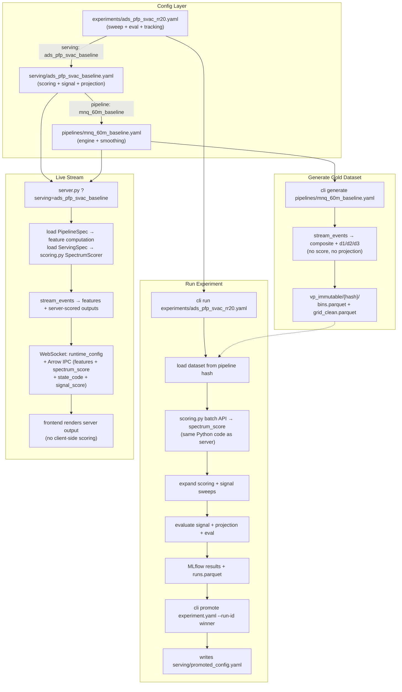

# Three Config Layers: Pipeline, Serving, Experiment

## Core Design

Three config layers with clean boundaries between data engineering + feature engineering (pipeline), modeling interpretation (serving), and experiment management (experiment):

- **Pipeline Config** -- transforms raw `.dbn` into a grid of engineered features at each price level relative to spot. Outputs per cell: pressure, vacuum, mass flows, velocity/acceleration/jerk of each flow type, the normalized composite `(P-V)/(|P|+|V|)`, and its time derivatives (d1/d2/d3). Also outputs permutation labels (best-price move tracking). **No scoring, no z-score normalization, no predictions.** Deterministic: same config + same code version = same dataset.
- **Serving Config** -- single-point parameterization of the modeling layer. References a pipeline by name. Defines scoring (z-score window, derivative blend weights, tanh scale, neutral threshold), signal (name, params, weights), and projection (horizons, cubic, damping). **No sweep axes, no eval metrics, no tracking.** This is what the server loads. This is what `cli promote` produces from a winning experiment run.
- **Experiment Config** -- references a serving config as its defaults. Adds everything needed for offline evaluation: eval (TP/SL/cooldown/warmup), sweep axes (over scoring + signal + projection params), parallel execution, and MLflow tracking. Many experiments can share a serving config. The sweep explores the neighborhood around the serving config defaults.

### Why Three Layers

| Concern | Config | Changes Invalidate |
|---------|--------|--------------------|
| Feature computation (tau, c1-c7, smoothing) | Pipeline | Cached datasets |
| Model interpretation (z-score, weights, thresholds) | Serving | Nothing -- reapplied to existing data |
| Experiment management (sweeps, eval, tracking) | Experiment | Nothing -- orchestration only |

The Serving Config exists because an Experiment Config has two incompatible purposes: (1) defining a sweep space with multiple TP/SL combos and parallel workers, and (2) defining a single-point serving configuration. When you promote a winner, you extract it into a ServingSpec -- a flat, sweep-free YAML the server loads directly.

### Layer Terminology

The plan uses precise terminology for the three engineering stages bundled into the pipeline:

| Stage | What | Parameterized By | Where |
|-------|------|-------------------|-------|
| Data Engineering | .dbn → normalized MBO events → book state | Nothing tunable | `event_engine.py` (internals) |
| Feature Engineering | book state → derivative chains → forces → composite + d1/d2/d3 | `tau_*`, `c1-c7`, `spectrum_windows` | `event_engine.py` (outputs) + `spectrum.py` (pipeline phase) |
| Modeling | features → z-score → score → signal → projection | `zscore_*`, `derivative_weights`, signal params | `scoring.py` + signals |

The Pipeline Config captures stages 1+2 (merged because there is no useful cache boundary between them). The Serving Config captures stage 3. The composite and its derivatives are **engineered features**, not physical observables -- the force model coefficients are design choices, not physics constants.

## Train/Serve Invariant

**The exact Python code that scores during harness evaluation must score during live serving.**

This is enforced by a single module: `backend/src/vacuum_pressure/scoring.py`

- `SpectrumScorer` class with two APIs:
  - **Incremental**: `update(d1, d2, d3) -> (score, state_code)` -- used by `stream_pipeline.py` in the live server, per bin, per cell
  - **Batch**: `score_dataset(grid_df, scoring_config) -> DataFrame` -- used by the harness runner, vectorized over the full dataset
- Both APIs are backed by the same ring-buffer z-score + tanh blend + threshold logic
- Equivalence is enforced by golden-vector tests (see Equivalence Tests section)
- The frontend does NOT compute scoring. It renders server-computed `spectrum_score` and `spectrum_state_code` from the Arrow IPC stream.

Why not client-side scoring:
- Z-score + tanh blend on 101 cells costs ~5-10us server-side. Bin interval is 100ms. Zero latency impact.
- Client-side would require TypeScript reimplementation -- two codebases, inevitable drift
- Page refresh loses ring buffer state; 30-second warmup gap with meaningless scores
- "Best in class latency" is achieved by doing more server-side, not less

## Pipeline Output Boundary

What the pipeline produces per time bin, per price level (bucket):

**Engineered features (in the pipeline -- deterministic, no learned params):**

- `k` -- price level relative to spot
- `add_mass`, `pull_mass`, `fill_mass`, `rest_depth`, `bid_depth`, `ask_depth` -- raw flow masses
- `v_add`, `v_pull`, `v_fill`, `v_rest_depth`, `v_bid_depth`, `v_ask_depth` -- velocities
- `a_add`, `a_pull`, `a_fill`, `a_rest_depth`, `a_bid_depth`, `a_ask_depth` -- accelerations
- `j_add`, `j_pull`, `j_fill`, `j_rest_depth`, `j_bid_depth`, `j_ask_depth` -- jerks
- `pressure_variant`, `vacuum_variant` -- aggregated pressure/vacuum per cell
- `composite` -- normalized balance: `(P-V)/(|P|+|V|)`, range [-1, +1]
- `composite_d1`, `composite_d2`, `composite_d3` -- time derivatives of the smoothed composite (d1=velocity, d2=acceleration, d3=jerk of the P/V balance)
- `best_ask_move_ticks`, `best_bid_move_ticks`, `ask_reprice_sign`, `bid_reprice_sign` -- BBO move tracking
- `perm_microstate_id`, `perm_state5_code`, `chase_up_flag`, `chase_down_flag` -- permutation labels
- `last_event_id` -- event sequence marker

**Scored outputs (computed server-side by scoring.py when a ServingSpec is active):**

- `spectrum_score` -- weighted tanh blend of z-scored derivatives (computed from composite_d1/d2/d3 + ServingSpec scoring params)
- `spectrum_state_code` -- discretized score ({-1, 0, +1} from spectrum_score + threshold_neutral)
- `signal_score` -- composite signal output (when signal is configured)

The composite and its derivatives are deterministic feature transformations: "how is the pressure/vacuum balance changing at this price level, and at what rate." The z-score normalization, weighted blend, and threshold classification are modeling choices parameterized by the ServingSpec.

## Pipeline Config Parameters

What stays in the pipeline config (affects the feature output, invalidates cached datasets):

- **Engine coefficients**: `tau_velocity`, `tau_acceleration`, `tau_jerk`, `tau_rest_decay`, `c1_v_add` through `c7_a_pull` -- control the force-model feature engineering
- **Grid structure**: `cell_width_ms`, `grid_radius_ticks`, `n_absolute_ticks`, `bucket_size_dollars`
- **Spectrum smoothing**: `spectrum_windows`, `spectrum_rollup_weights` -- control the rolling window averaging applied to the composite BEFORE differencing (affects d1/d2/d3 values)
- **Capture coordinates**: product_type, symbol, dt, start_time, end_time
- **Code version**: `pipeline_code_version` -- bumped when computation code changes (not just params), invalidates all cached datasets with the old version

What moves to the serving/experiment config (does NOT affect the feature output):

- `spectrum_derivative_weights` -- how to blend d1/d2/d3 into score
- `spectrum_tanh_scale` -- compression scale for z-scored derivatives
- `spectrum_threshold_neutral` -- what counts as neutral state
- `zscore_window_bins`, `zscore_min_periods` -- z-score normalization window
- `projection_horizons_bins/ms` -- prediction horizons
- All projection model params (`use_cubic`, `cubic_scale`, `damping_lambda`)
- Signal params and weights

## Config Formats

### Pipeline Config

Stored in `backend/lake/research/vp_harness/configs/pipelines/<name>.yaml`:

```yaml
name: mnq_60m_baseline
description: "MNQ 60-minute session, default force model"
pipeline_code_version: 1

capture:
  product_type: future_mbo
  symbol: MNQH6
  dt: "2026-02-06"
  start_time: "09:25"
  end_time: "10:25"

pipeline:
  cell_width_ms: 100
  tau_velocity: 2.0
  tau_acceleration: 5.0
  tau_jerk: 10.0
  tau_rest_decay: 30.0
  c1_v_add: 1.0
  c2_v_rest_pos: 0.5
  c3_a_add: 0.3
  c4_v_pull: 1.0
  c5_v_fill: 1.5
  c6_v_rest_neg: 0.5
  c7_a_pull: 0.3
  spectrum_windows: [5, 10, 20, 40]
  spectrum_rollup_weights: [1.0, 1.0, 1.0, 1.0]
```

All values are overrides to `instrument.yaml`. Omitted keys inherit locked defaults. The deterministic `dataset_id` hash is computed from `pipeline_code_version + capture + pipeline` only.

### Serving Config

Stored in `backend/lake/research/vp_harness/configs/serving/<name>.yaml`:

```yaml
name: ads_pfp_svac_baseline
description: "ADS+PFP+SVac baseline serving params"

pipeline: mnq_60m_baseline

scoring:
  zscore_window_bins: 300
  zscore_min_periods: 75
  derivative_weights: [0.55, 0.30, 0.15]
  tanh_scale: 3.0
  threshold_neutral: 0.15

signal:
  name: ads_pfp_svac
  params:
    ads_slope_windows_ms: [1000, 2500, 5000]
    ads_zscore_window_ms: 20000
    ads_warmup_ms: 20000
    pfp_lag_ms: 500
    pfp_ema_alpha: 0.05
  weights:
    ads: 0.40
    pfp: 0.25
    svac: 0.30

projection:
  horizons_ms: [250, 500, 1000, 2500]
  use_cubic: false
  cubic_scale: 0.16666666666666666
  damping_lambda: 0.0
```

This is a single-point configuration. No sweeps, no eval, no tracking. The server loads this directly. `cli promote` writes this from a winning experiment run.

### Experiment Config

Stored in `backend/lake/research/vp_harness/configs/experiments/<name>.yaml`:

```yaml
name: ads_pfp_svac_sweep_rr20
description: "ADS+PFP+SVac risk/reward sweep, TP 18-24, SL 6-10"

serving: ads_pfp_svac_baseline

eval:
  tp_ticks: [18, 20, 22, 24]
  sl_ticks: [6, 8, 10]
  max_hold_bins: 1200
  warmup_bins: 300
  tick_size: 0.25
  cooldown_bins: 20
  min_signals: 5

sweep:
  scoring:
    zscore_window_bins: [200, 300, 400]
    derivative_weights:
      - [0.55, 0.30, 0.15]
      - [0.50, 0.35, 0.15]
    tanh_scale: [2.0, 3.0, 4.0]
  per_signal:
    ads_pfp_svac:
      pfp_lag_ms: [300, 500]
      pfp_ema_alpha: [0.05, 0.1]
      composite_weight_ads: [0.35, 0.40]
      composite_weight_pfp: [0.25, 0.30]
      composite_weight_svac: [0.30]

parallel:
  max_workers: 3
  timeout_seconds: 7200

tracking:
  backend: mlflow
  experiment_name: vp/tuning/ads_pfp_svac_rr20
```

The `serving` field references a ServingSpec whose values are the sweep center/defaults. Sweep axes explore the neighborhood around those defaults. Scoring params can be swept without regenerating the dataset. Changing scoring params does NOT require regenerating the dataset.

## Architecture



## Implementation

### 1. Pipeline Config Schema

**New file:** `backend/src/vacuum_pressure/pipeline_config.py`

- `CaptureConfig`: product_type, symbol, dt, start_time, end_time
- `PipelineOverrides`: engine coefficients + spectrum smoothing windows (every field optional, inherits from instrument.yaml). Explicitly excludes zscore, scoring, and projection params.
- `PipelineSpec`: name, description, pipeline_code_version, capture, pipeline
- `resolve_runtime_config()` -- loads instrument.yaml, applies overrides, returns VPRuntimeConfig
- `dataset_id()` -- deterministic hash of `pipeline_code_version + capture + pipeline`. When computation code changes (bug fix in event_engine.py, changed derivative formula), bump `pipeline_code_version` to invalidate all cached datasets.

### 2. Serving Config Schema

**New file:** `backend/src/vacuum_pressure/serving_config.py`

- `ScoringConfig`: zscore_window_bins, zscore_min_periods, derivative_weights, tanh_scale, threshold_neutral
- `SignalConfig`: name, params (dict), weights (dict)
- `ProjectionConfig`: horizons_ms, use_cubic, cubic_scale, damping_lambda
- `ServingSpec`: name, description, pipeline (str ref), scoring, signal, projection
- `resolve_pipeline()` -- loads the referenced PipelineSpec
- `to_runtime_config_json()` -- serializes for the WebSocket `runtime_config` message

This is a flat, sweep-free config. The server loads it directly. `cli promote` writes it.

### 3. Experiment Config Schema

**New file:** `backend/src/vacuum_pressure/experiment_config.py`

- `EvalConfig`: tp_ticks, sl_ticks, max_hold_bins, warmup_bins, tick_size, cooldown_bins, min_signals
- `SweepConfig`: scoring overrides, per_signal overrides (each field is a list of values to sweep)
- `ExperimentSpec`: name, description, serving (str ref), eval, sweep, parallel, tracking
- `resolve_serving()` -- loads the referenced ServingSpec (which transitively loads PipelineSpec)
- `to_harness_config()` -- translates to existing harness runner format, expanding sweep axes
- `extract_winning_serving(run_id)` -- given a run result, produces a new ServingSpec with the winning params

### 4. Scoring Module (Single Implementation)

**New file:** `backend/src/vacuum_pressure/scoring.py`

The single source of truth for all scoring computation. Two APIs, same internal logic:

**Incremental API** (used by server `stream_pipeline.py`):

```python
class SpectrumScorer:
    def __init__(self, config: ScoringConfig, n_cells: int): ...
    def update(self, d1: np.ndarray, d2: np.ndarray, d3: np.ndarray) -> tuple[np.ndarray, np.ndarray]:
        """Per-bin update. Returns (spectrum_score, spectrum_state_code) arrays of shape (n_cells,)."""
```

Internally maintains ring buffers for z-score computation (median + MAD). Same data structures as current `IndependentCellSpectrum` steps 4-6, extracted into this module.

**Batch API** (used by harness runner):

```python
def score_dataset(grid_df: pd.DataFrame, config: ScoringConfig) -> pd.DataFrame:
    """Adds spectrum_score and spectrum_state_code columns to grid_df.

    Internally instantiates SpectrumScorer and calls update() per bin in sequence.
    This guarantees identical ring-buffer state evolution as the incremental API.
    NOT a vectorized shortcut -- same code path, same results."""
```

The batch API is deliberately NOT a vectorized `pd.rolling()` shortcut. It instantiates the same `SpectrumScorer` and calls `update()` per bin in chronological order. This guarantees bitwise-identical results between harness and server.

### 5. Refactor IndependentCellSpectrum

**Modify:** [spectrum.py](backend/src/vacuum_pressure/spectrum.py)

Split into pipeline phase only. Scoring phase moves to `scoring.py`.

**Pipeline phase** (stays in spectrum.py, used by stream_pipeline.py):

- Composite computation: `(P-V)/(|P|+|V|)`
- Rolling window smoothing (configurable windows + weights)
- Time derivatives: d1, d2, d3 of the smoothed composite
- Output: `CompositeOutput(composite, d1, d2, d3)` per cell

**Scoring phase** (moves to scoring.py):

- Z-score normalization of d1/d2/d3 (ring buffer, MAD-based)
- Weighted tanh blend -> score
- State code discretization
- Used by server (incremental) and harness (batch via sequential incremental calls)

### 6. Update Grid Output + Arrow Schema

**Modify:** [stream_pipeline.py](backend/src/vacuum_pressure/stream_pipeline.py) `_build_bin_grid()`

Add new feature columns:

- `composite` (float64) -- normalized P/V balance [-1, +1]
- `composite_d1` (float64) -- first time derivative of smoothed composite
- `composite_d2` (float64) -- second time derivative
- `composite_d3` (float64) -- third time derivative

Keep scored columns (now computed by `scoring.py` when ServingSpec is active):

- `spectrum_score` (float64) -- server-computed, same code as harness
- `spectrum_state_code` (int8) -- server-computed

Add signal column (when signal is configured):

- `signal_score` (float64) -- composite signal output

**Modify:** [server.py](backend/src/vacuum_pressure/server.py) `_BASE_GRID_FIELDS`

Update Arrow IPC schema to include both feature and scored columns.

When `?pipeline=name` only (no serving config): `spectrum_score` and `spectrum_state_code` are NaN/-1 (sentinel). Features are always present.

When `?serving=name`: all columns populated by the server.

### 7. CLI: `generate` + `run` + `promote`

**Modify:** [cli.py](backend/src/experiment_harness/cli.py)

`generate`: Takes PipelineSpec YAML, runs stream_events (no scoring/projection), captures to vp_immutable/{dataset_id}/. Idempotent -- skips if hash already exists.

`run`: Takes ExperimentSpec YAML, resolves serving -> pipeline, auto-generates dataset if missing, applies scoring via `scoring.py` batch API (same code as server), expands sweeps, evaluates, logs to MLflow.

`promote`: Takes ExperimentSpec YAML + `--run-id` (from MLflow or results parquet). Extracts the winning parameter point from the sweep. Writes a new ServingSpec YAML to `configs/serving/`. Prints:
- The serving URL: `http://localhost:5174/vacuum-pressure.html?...&serving=<name>`
- The diff from the previous serving config (if any)
- The instrument.yaml overrides needed for permanent adoption

### 8. Server: `pipeline` + `serving` Query Params

**Modify:** [server.py](backend/src/vacuum_pressure/server.py)

`?pipeline=name`: Loads PipelineSpec, streams features only (composite + derivatives). Scored columns are sentinel values. Matches gold dataset output exactly. Use for data inspection.

`?serving=name`: Loads PipelineSpec (from serving config's pipeline ref) + ServingSpec. Server runs `scoring.py SpectrumScorer` per bin (same code as harness). Streams features + scored outputs. Sends full serving config in `runtime_config` message:

```json
{
  "type": "runtime_config",
  "...VPRuntimeConfig fields...",
  "pipeline_name": "mnq_60m_baseline",
  "serving_name": "ads_pfp_svac_baseline",
  "scoring": {
    "zscore_window_bins": 300,
    "zscore_min_periods": 75,
    "derivative_weights": [0.55, 0.30, 0.15],
    "tanh_scale": 3.0,
    "threshold_neutral": 0.15
  },
  "signal_config": {
    "name": "ads_pfp_svac",
    "params": { "..." },
    "weights": { "ads": 0.40, "pfp": 0.25, "svac": 0.30 }
  },
  "projection": {
    "horizons_ms": [250, 500, 1000, 2500],
    "use_cubic": false,
    "cubic_scale": 0.16666666666666666,
    "damping_lambda": 0.0
  }
}
```

No eval_config in the runtime_config -- eval is an experiment concern, not a serving concern.

### 9. Frontend: Render Server Output

**Modify:** [vacuum-pressure.ts](frontend/src/vacuum-pressure.ts)

Frontend consumes server-computed `spectrum_score`, `spectrum_state_code`, and `signal_score` from Arrow IPC. No client-side scoring computation in the production path. The `runtime_config` message carries the serving config for display labeling (show which config is active, parameter values in the UI header).

URL params:
- `&pipeline=name` -- raw feature view (no scores rendered)
- `&serving=name` -- full scored view (server scores everything)

**Modify:** [experiment-engine.ts](frontend/src/experiment-engine.ts)

Becomes an optional **dev-mode overlay** only, enabled by `&dev_scoring=true` URL param. When active, it computes client-side scoring in parallel with server scoring for visual comparison. This is explicitly NOT the production path and carries a UI badge warning "DEV: client-side scoring -- may differ from server."

### 10. Equivalence Tests

**New file:** `backend/tests/test_scoring_equivalence.py`

Three tiers of equivalence testing:

**Tier 1 -- Golden vectors (unit test, no .dbn):**

```python
def test_scorer_golden_vectors():
    """Known d1/d2/d3 input sequences -> known score outputs.
    Tests the SpectrumScorer in isolation. Pinned expected values."""
```

**Tier 2 -- Incremental vs batch API (unit test, no .dbn):**

```python
def test_incremental_equals_batch():
    """Generate synthetic composite derivatives.
    Run SpectrumScorer.update() incrementally.
    Run score_dataset() batch.
    Assert identical outputs for ALL bins (including warmup)."""
```

**Tier 3 -- Server vs harness on real data (integration test, needs .dbn):**

```python
def test_server_scoring_matches_harness():
    """Run stream_events() with a ServingSpec on a known .dbn segment.
    Capture per-(bin, k) spectrum_score from the server path.
    Generate dataset, then score_dataset() via harness path.
    Assert identical spectrum_score for all (bin, k) pairs within IEEE 754 tolerance."""
```

These tests run in CI. Any change to scoring.py, spectrum.py, or stream_pipeline.py that causes drift is caught immediately.

## Files Changed Summary

- **New:** `backend/src/vacuum_pressure/pipeline_config.py` -- PipelineSpec schema + loader + hash
- **New:** `backend/src/vacuum_pressure/serving_config.py` -- ServingSpec schema + loader
- **New:** `backend/src/vacuum_pressure/experiment_config.py` -- ExperimentSpec schema + loader + promote logic
- **New:** `backend/src/vacuum_pressure/scoring.py` -- SpectrumScorer (incremental + batch), single implementation for server and harness
- **New:** `backend/tests/test_scoring_equivalence.py` -- golden vectors + incremental/batch parity + server/harness parity
- **New:** `backend/lake/research/vp_harness/configs/pipelines/` -- pipeline config directory
- **New:** `backend/lake/research/vp_harness/configs/serving/` -- serving config directory
- **New:** `backend/lake/research/vp_harness/configs/experiments/` -- experiment config directory
- **Modify:** [spectrum.py](backend/src/vacuum_pressure/spectrum.py) -- pipeline phase only (composite + derivatives); scoring phase extracted to scoring.py
- **Modify:** [stream_pipeline.py](backend/src/vacuum_pressure/stream_pipeline.py) -- output composite+d1/d2/d3 as features; use scoring.py SpectrumScorer for scored outputs when ServingSpec is active
- **Modify:** [server.py](backend/src/vacuum_pressure/server.py) -- update Arrow schema (add features, keep scored columns), add pipeline/serving query params, send serving config in runtime_config
- **Modify:** [vacuum-pressure.ts](frontend/src/vacuum-pressure.ts) -- render server-scored outputs, display serving config label, remove client-side scoring from production path
- **Modify:** [experiment-engine.ts](frontend/src/experiment-engine.ts) -- dev-mode overlay only, not production path
- **Modify:** [cli.py](backend/src/experiment_harness/cli.py) -- `generate`, ExperimentSpec-aware `run`, `promote`
- **Modify:** `README.md` -- document three-config workflow + promote flow

## Workflow

```bash
# 1. Define the feature pipeline (engine + smoothing only)
vim backend/lake/research/vp_harness/configs/pipelines/mnq_60m_baseline.yaml

# 2. Generate the gold dataset (idempotent, no scoring/prediction)
cd backend && uv run python -m src.experiment_harness.cli generate \
  lake/research/vp_harness/configs/pipelines/mnq_60m_baseline.yaml

# 3. Define serving config (scoring + signal + projection -- single point)
vim backend/lake/research/vp_harness/configs/serving/ads_pfp_svac_baseline.yaml

# 4. Define experiment (sweep axes + eval + tracking around serving defaults)
vim backend/lake/research/vp_harness/configs/experiments/ads_pfp_svac_sweep_rr20.yaml

# 5. Run (auto-generates dataset if missing, scores via scoring.py, expands sweeps, evaluates)
cd backend && uv run python -m src.experiment_harness.cli run \
  lake/research/vp_harness/configs/experiments/ads_pfp_svac_sweep_rr20.yaml

# 6. Compare and identify winner
cd backend && uv run python -m src.experiment_harness.cli compare --min-signals 5

# 7. Promote winner to serving config
cd backend && uv run python -m src.experiment_harness.cli promote \
  lake/research/vp_harness/configs/experiments/ads_pfp_svac_sweep_rr20.yaml \
  --run-id <winner_run_id>
# -> writes configs/serving/ads_pfp_svac_sweep_rr20_promoted.yaml
# -> prints serving URL and instrument.yaml diff

# 8. Stream with promoted serving config (server scores everything, frontend renders)
open "http://localhost:5174/vacuum-pressure.html?...&serving=ads_pfp_svac_sweep_rr20_promoted"

# 9. (Optional) Make permanent: update instrument.yaml with promoted params, restart
```

## Iteration Patterns

**Change the feature pipeline** (tau values, force coefficients, smoothing windows):

- New pipeline YAML (or bump `pipeline_code_version`) → `generate` → new dataset hash → re-run experiments

**Change scoring params** (z-score window, derivative weights, tanh scale):

- Edit serving YAML or add sweep axes in experiment YAML → `run` → reuses same dataset → new results
- Can sweep scoring params alongside signal params

**Change signal/projection** (weights, horizons):

- Edit serving YAML → `run` → reuses same dataset
- Server reflects changes immediately via `?serving=name` param

**Promote a winner to production**:

- `cli promote` → new serving YAML → restart server with `?serving=name` or update instrument.yaml

**Bug fix in feature computation code**:

- Fix the code, bump `pipeline_code_version` in all affected pipeline YAMLs → `generate` (invalidates old hash, regenerates) → re-run experiments
